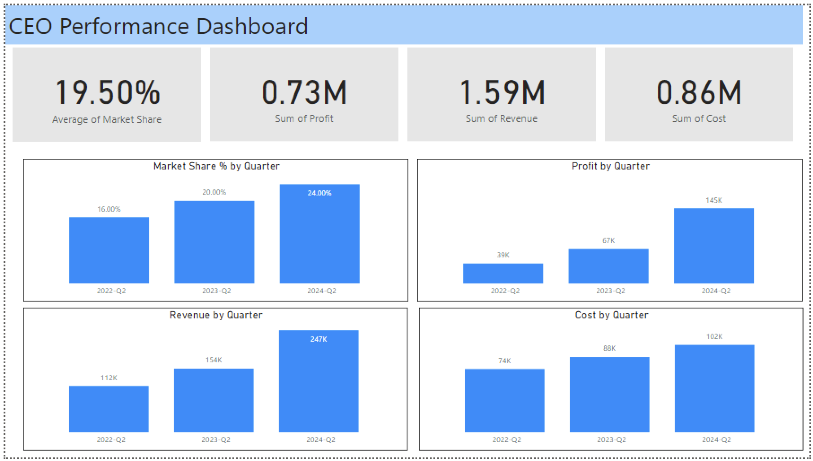

# eCommerce Fashion Dashboard

## CEO

### Information
- **White Hat (Facts & Information):**
  - Look at the numbers and data on your dashboard.
  - Check if your revenue is going up or down.
  - See how much of the market your company has.
  - Look at how happy your employees are.
  - Check if customers are liking your products or services.

- **Red Hat (Feelings & Intuition):**
  - How do you feel when you see the numbers?
  - Are you happy because revenue is growing?
  - Are you worried if costs are too high?
  - Do you think your employees are happy?
  - Are you confident that customers are satisfied?

- **Black Hat (Critical Thinking):**
  - Are there any problems with the numbers?
  - Is there something that's not making sense?
  - Are there any areas where you're losing money?
  - Are there unhappy employees that need attention?
  - Are there any complaints from customers?

- **Yellow Hat (Positive Thinking):**
  - What's going well with your company's growth?
  - Are there areas where revenue is doing really well?
  - Do you have a strong presence in the market?
  - Are your employees enjoying their work?
  - Are customers giving good feedback?

- **Green Hat (Creativity & Ideas):**
  - How can you improve revenue even more?
  - Are there new markets you could explore?
  - What can you do to make employees even happier?
  - How can you make your products or services better for customers?

- **Blue Hat (Big Picture & Organization):**
  - Overall, what does the dashboard tell us about the company?
  - How do all these numbers fit into the CEO's goals?
  - What actions can we take based on what we see here?
  - Are there any changes we need to make in our strategy?

### The metrics needed by the CEO for several important reasons
#### 1. Overall Revenue Growth

- **Description:** Indicates the company's ability to generate income over a specific period.
- **Importance:** Directly influences the company's profitability and sustainability.
- **Purpose:** Aims to increase revenue, leading to higher profits and enabling investments in growth opportunities.

#### 2. Market Share

- **Description:** Represents the portion of total sales in an industry that the company captures.
- **Importance:** Indicates the company's competitiveness and positioning within the market.
- **Purpose:** Helps assess the effectiveness of strategies compared to competitors and identify expansion or improvement opportunities.

#### 3. Employee Engagement

- **Description:** Measures the level of commitment, motivation, and satisfaction of employees.
- **Importance:** Affects productivity, innovation, and employee retention.
- **Purpose:** Promotes a positive work environment and attracts and retains top talent.

#### 4. Customer Satisfaction

- **Description:** Reflects the extent to which customers are happy with the products, services, and overall experience provided by the company.
- **Importance:** Influences customer loyalty, repeat purchases, and brand reputation.
- **Purpose:** Identifies areas for improvement, addresses customer concerns, and maintains a strong market reputation.
